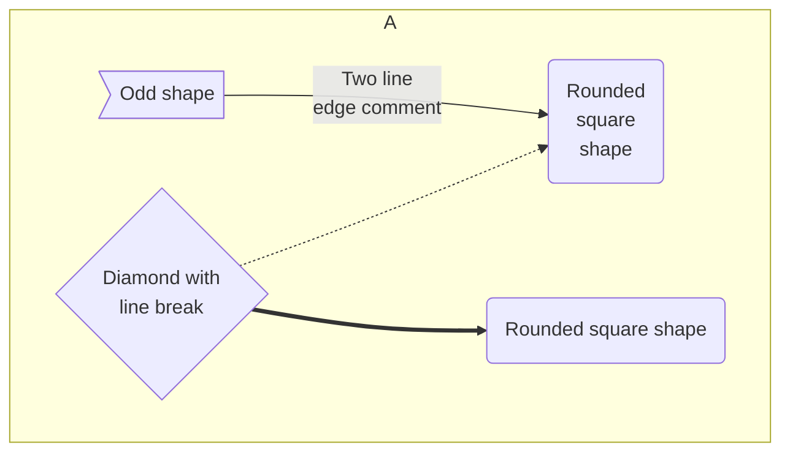

## Skills system structure

- SkillSlotManager
  - SkillHandler
  - SkillHandler
    - Cooldown Mgr
    - Ref to skill node
    - SkillData
    - InputMgr
- 

```mermaid
graph TD;
    subgraph A
        od>Odd shape]-- Two line<br/>edge comment --> ro
        di{Diamond with <br/> line break} -.-> ro(Rounded<br>square<br>shape)
        di==>ro2(Rounded square shape)
    end
```